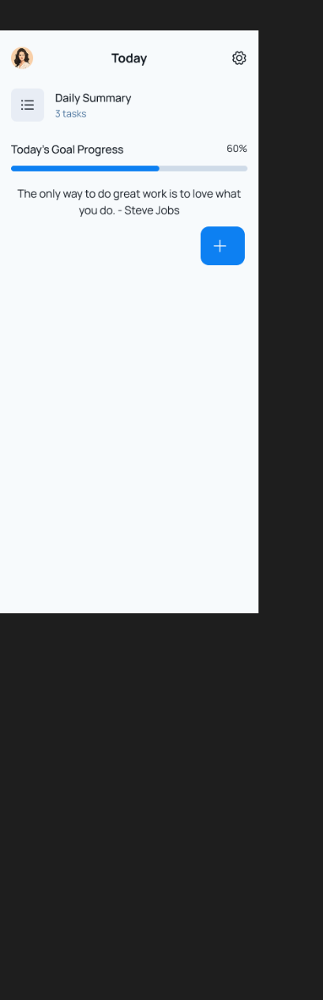
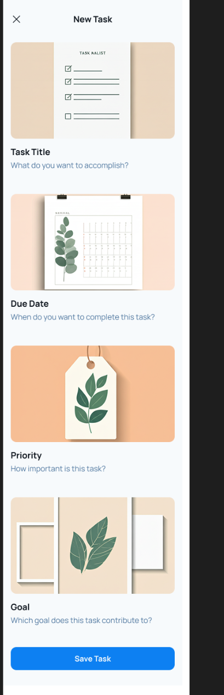
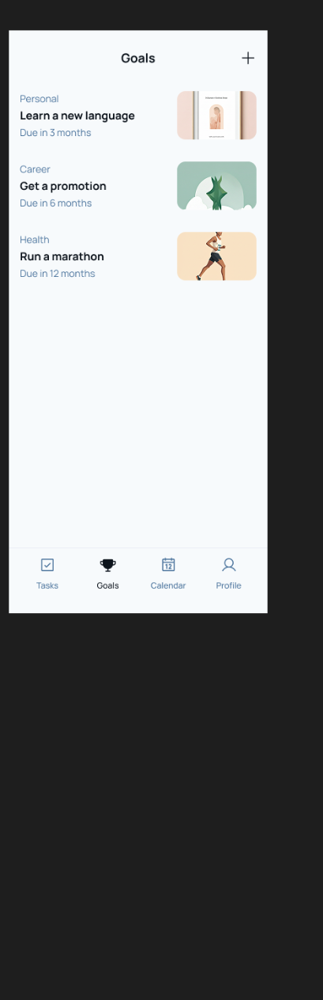
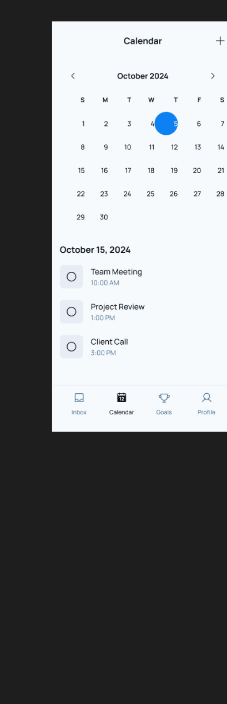
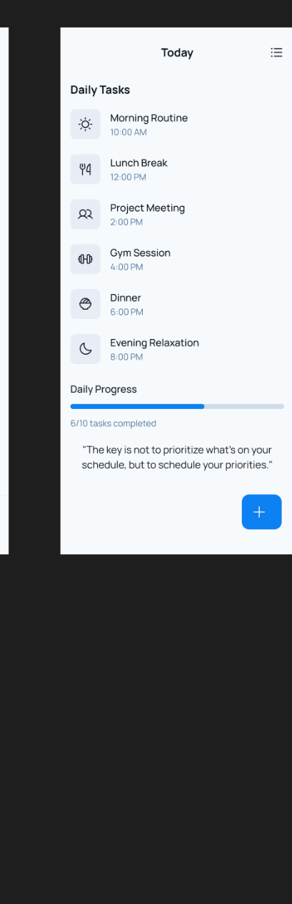
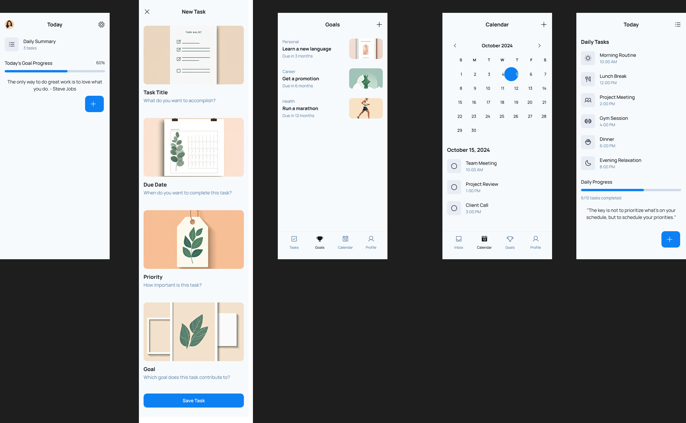

# FocusFlow-Personal-Productivity-App-UI-Design

Project Overview:
This is a modern and user-focused productivity app design built to simplify daily life. The interface ensures users can plan, organize, and track their day with ease and clarity.
✨ Key Highlights of the Design:
A clean Home Dashboard that provides a quick snapshot of tasks, progress, and goals.
Simple yet powerful interface to add, edit, and manage tasks seamlessly.
Daily goal tracking to keep users motivated and aligned with their routines.
An integrated Calendar view to visualize tasks and events across days.
A dedicated Daily Task section that ensures nothing important slips through.
Design Approach:
The design focuses on clarity, ease of navigation, and an intuitive experience for individuals who want to boost their productivity without feeling overwhelmed. Every screen is thoughtfully crafted to support efficient task management and time planning.

## 📸 UI Screens Preview

<table>
  <tr>
    <td><b>Home</b></td>
    <td><b>New Task</b></td>
    <td><b>Goals</b></td>
  </tr>
  <tr>
    <td></td>
    <td></td>
    <td></td>
  </tr>

   <tr>
    <td><b>Calendar</b></td>
    <td><b>Daily Task Timeline</b></td>
  </tr>
  <tr>
    <td></td>
    <td></td>
  </tr>
</table>

## 📸 Preview

## 🔗 Live Prototype (Figma)

🔧 Tools Used:
Figma
UI/UX Design Principles
